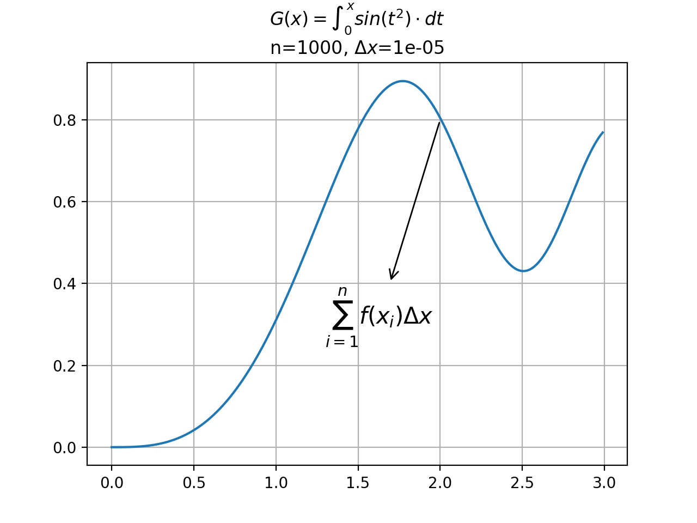

# calc_diferencial

This is a Python project that uses matplotlib to visualize and calculate the area under a curve using the left and right rectangle method.

## Dependencies

The following packages are required to run this application:

- numpy
- matplotlib

## Documentation

For more information on the math behind this application, check out the following documents:

- [sumatoria.pdf](docs/sumatoria.pdf)
- [sumatoria_v2.pdf](docs/sumatoria_v2.pdf)

## Output

The application will generate a series of images in the `img` folder showing the rectangles used to approximate the area under the curve for different values of `n`. The images will also show the calculated area.

Here is an example of one of the generated images by the calc.py script:

Here is another example of the output of calc_v2.py script:

